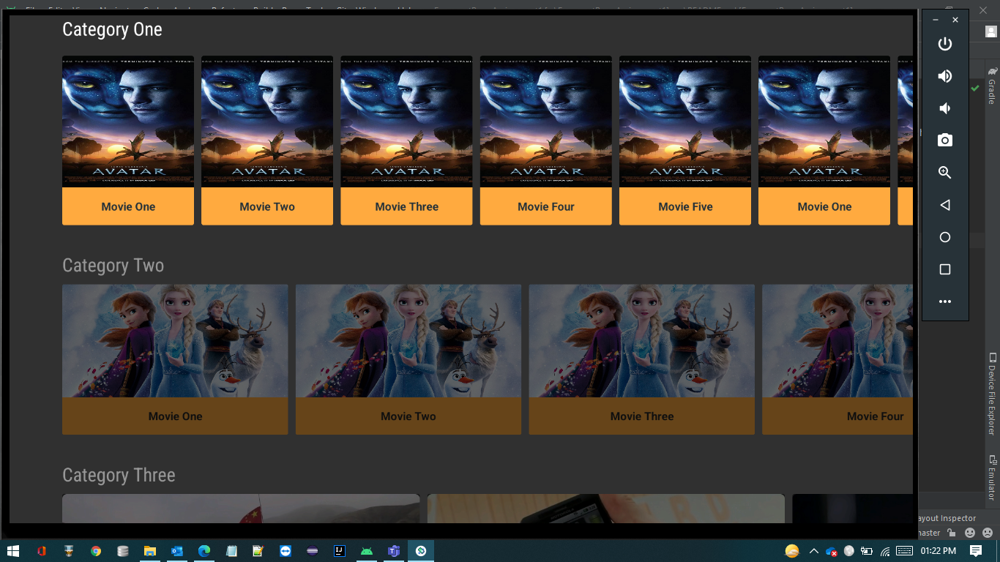
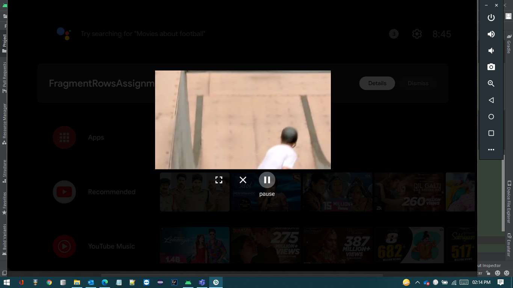

# Team-2 POC

## Description
This project is having different layout items in each row with content metadata, through which user can watch the content in player, even in **Picture-In-Picture** mode.  

## There are 2 major Tasks: 
1. Rendering Rails - A fragment with 5 rows of different layout.
2. PIP - Picture In Picture mode proof of concept.

## 1. Rendering Rails - A fragment with 5 rows of different layout.
Application has 5 rows of different layout and different row title. Each item in a row is rendered by different **Presenters** & contain its own content metaData( _ID, CardImage, Title, Description, Playback URL_). Clicking on item it should navigate to `PlayerActivity`, which contains player. 



### Layout Type With Presenter:
- Portrait Card
    - Presenter - **`CardPresenterPortrait.kt`**
- Landscape Card
    - Presenter - **`CardPresenterLandscape.kt`**
- Big Portrait Card
    - Presenter - **`BigCardPresenterPortrait.kt`**
- Big Landscape Card
    - Presenter - **`BigCardPresenterLandscape.kt`**
- Square Card
    - Presenter - **`CardPresenterSquare.kt`**
    
## 2. Picture In Picture Mode
When user reaches to player screen and click home button, Player will go to PIP mode. User can interact with other apps & content will keep playing on PIP Window until user close it.



We have added play and pause action in PIP along with fullscreen/close action. Those actions are handling using `PendingIntent` & `BroadcastReceiver`. Below is the code snippet:

```Kotlin

val param = PictureInPictureParams.Builder()
              .setActions(getAction()).setAspectRatio(getAspectRatio())
              .build()
enterPictureInPictureMode(param)

```

```Kotlin

private fun getAction() : List<RemoteAction> {
  val intent: PendingIntent = PendingIntent.getBroadcast(
    this, ACTION_TYPE_PAUSE,
    Intent(ACTION_PIP).putExtra(ACTION_CONTROL_TYPE_KEY, ACTION_TYPE_PAUSE),
    PendingIntent.FLAG_IMMUTABLE)
  
  val icon: Icon = Icon.createWithResource(this, R.drawable.ic_pause_24dp)
  val remoteAction = RemoteAction(icon, PAUSE, PAUSE, intent)
  return listOf(remoteAction )
}

```
On clicking play & pause button, app will receive broadcast with mentioned action & updating the PIP Parameter & button at same time. 

```Kotlin

when(actionTypeReceivedFromBroadcast){
  pauseAction -> {
    playbackTransportControlGlue!!.pause()
    updatePipAction("play", playAction, R.drawable.playIcon)
  }
  playAction -> {
    playbackTransportControlGlue!!.play()
    updatePipAction("pause", pauseAction, R.drawable.pauseIcon)
  }

}

```

---

## Reference

- <a href="https://developer.android.com/guide/topics/ui/picture-in-picture">PIP Developer Doc</a> 
- <a href="https://www.youtube.com/watch?v=TxAbht2DkyU">PIP Video Guide</a>
  

